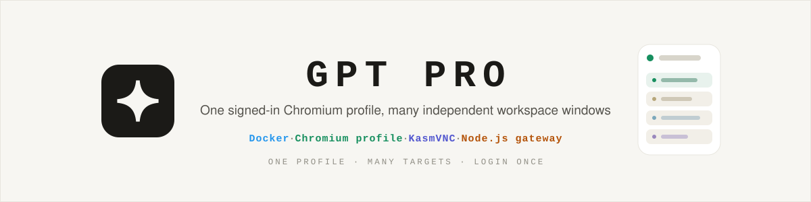

<div align="center">



# GPT Pro——一个 Pro 登录，多个独立工作窗口

[](docker-compose.yml)
[](gateway/)
[](docker/)
[](Deploy.md)
[](LICENSE)

[English](README.md) | **简体中文**

</div>

GPT Pro 在你控制的机器上运行一份持久化 Chromium Profile。你只登录一次 ChatGPT，然后按需创建任意数量的逻辑工作区。每个工作区都是一个独立顶层 Chromium 窗口中的 Page Target，拥有固定的网关地址、画面流与输入通道；所有窗口共享同一份 ChatGPT Cookie 与 Pro 权益。

这个 fork 的主要场景是一位操作者在办公室、实验室、家里等多个地点使用同一个 Pro 账号，同时希望每个项目始终回到自己的页面，不被其它窗口打断。

> **账号政策边界：**网关用户名只是本地访问与路由凭据，不是不同的 ChatGPT 身份。不同人员共用一个 ChatGPT 账号可能违反 OpenAI 的条款或政策；本软件不会让账号共享自动变得合规，也与 OpenAI 没有从属关系。

## 架构

```text
客户端 /w/project-a/ ── 路径独立登录 ─┐
客户端 /w/project-b/ ── 路径独立登录 ─┼─▶ gateway ─▶ CDP sessionId ─▶ 独立窗口 A / B / …
客户端 /w/project-n/ ── 路径独立登录 ─┘                         │
                                                                    ▼
                                                   一只 Chromium 进程 + 一份 Profile
                                                   一次 ChatGPT 登录 + 一套网络栈

管理员 ─▶ /admin/maintenance/ ─▶ 完整 KasmVNC Chromium 浏览器
```

- 工作区和用户由持久化数据动态创建；主机资源允许时可继续增减。
- 每个工作区 Target 会在自己的顶层窗口内写入运行标记。网关重启时认领现有窗口；Chromium 重启时按持久化的最后 URL 重建。
- 客户端窗口使用 `/w/<workspace-id>/`。其 HttpOnly Cookie 只作用于这条路径，所以同一个本地浏览器 Profile 可以在不同工作区窗口同时登录不同的网关用户。
- 鼠标、键盘和文本输入都携带当前工作区的 CDP `sessionId`；客户端拿不到原始 Target ID 或 DevTools 凭据。
- 每个可见工作区独立启动 CDP 连续帧流，由 Chromium 主动推送 JPEG，不再逐帧调用截图命令，也不存在跨工作区的全局串行队列。命名 CDP 隔离环境中的轻量信号只观察 DOM 节点/文字、滚动、输入和尺寸活动，静止时抑制纯合成帧。源帧到达后立即确认，网关按真实经过时间执行前台与可见后台交付预算；没有可见观看者时停止流并最小化远端窗口。慢客户端只丢弃过期帧，静止画面复用最后一帧做保活，不会无界堆积缓冲。
- 普通工作区 Target 加载管理员可配置的敏感操作黑名单：命中控件会隐藏，点击或键盘激活在网关发送 CDP `Input` 事件前再次检查，明确的 URL 黑名单由 Chromium 阻断。页面不再安装捕获阶段事件拦截器，普通文档请求也不会经 `Fetch` 暂停、继续或改写。DOM 变化只复核新增区域。账号、订阅、安全、全局设置与 ChatGPT 退出登录只在管理员浏览器操作。
- 普通入口只显示项目画布、常驻的项目首页按钮和默认折叠的控制面板；网页端侧边栏、左上角项目名称/图标入口、项目菜单、分享、Chat/Work 切换、听写与语音入口会在受管页面隐藏。项目首页分享、对话分享和单条消息分享在输入发送前同时拒绝。管理员可逐行配置 `@` / `+` 功能白名单，规则按完整功能名匹配，不依赖位置或数量；默认只允许 `Add photos & files`、`Create image`、`Web search` 和 `Deep research`。Sources 的 Add sources 固定只保留 `Upload` 与 `Text input`。普通页面打开的新窗口会立即关闭，顶层页面也不能离开 `chatgpt.com`。起始地址是已识别的 ChatGPT 项目 URL 时，项目首页可以进入或新建项目对话，即使 ChatGPT 为对话路由分配了不同的 `g-p` 标识；进入某一对话后，只允许停留在该对话或通过常驻按钮返回配置的项目首页。该机制会修改 DOM/CSS，属于界面与权限收敛，不是“网页不可探查”或规避风控保证。
- 管理员入口直接使用 KasmVNC 核心页面，不启动音频/文件包装层。Kasm 连接存续时会保持未受管的管理员 Chromium 窗口在最前，用于 ChatGPT 登录/退出、MFA、Profile 全局管理和 Chrome 扩展安装，不是普通工作区并发通道。
- 本机上传只保存到当前用户的私人目录，不会自动交给 ChatGPT。用户在 ChatGPT 页面点击上传后，再从私人文件面板手动选择并确认。Chromium 下载也只经过独立传输目录；gateway 不挂载 Chromium Profile。
- 时区、JavaScript 默认 locale、`navigator.languages` 和 HTTP `Accept-Language` 是唯一 Profile 的全局设置，所有 Target 与管理员浏览器保持一致。
- 普通工作区把访问设备本机浏览器接收到的英文、中文、日文、韩文、表情、粘贴或其它最终文本直接提交给所属 Target；输入法候选和未完成组合始终留在本机。远端纯文本选区只映射到当前用户页面的隐藏输入框，因此原生 `Cmd/Ctrl+C` 与 `Cmd/Ctrl+X` 可以复制或剪切到访问设备的剪贴板。ChatGPT 消息复制按钮保持可见，并把产生的远端系统剪贴板文本交给点击它的本机窗口。管理员桌面直接启用 KasmVNC 的原生 IME Input Mode，不再叠加项目自建输入法。

## 本机部署

要求：Docker 与 Compose v2。macOS、Windows 可用 Docker Desktop，Linux Docker 主机也可运行。

```bash
git clone https://github.com/yueqingyou/GPT-Pro-Cloud.git
cd GPT-Pro-Cloud
cp .env.example .env
./scripts/up.sh
```

打开 `http://127.0.0.1:36090/admin/`：

1. 创建管理员；若已通过 `AUTH_PASSWORD` 预设，则直接登录。
2. 核对“浏览器环境”。首次启动会按 Chromium 实际出口自动探测时区与语言；结果不合适时由管理员手动改写。
3. 若 ChatGPT 已有 Projects，点击“读取 Projects”预览并导入所选；工作区名、用户名和初始密码使用项目名，冲突项不会覆盖。也可手动新增逻辑工作区。
4. 按需手动新增本地用户并分配工作区。用户和工作区数量都不写死。
5. 核对“`@` / `+` 功能白名单”。每行保存一个菜单显示的完整功能名；清空列表会禁用所有编辑器菜单功能。
6. 核对“普通工作区敏感操作黑名单”。默认会把账号菜单、设置、退出登录、订阅、安全和破坏性全局操作保留给管理员。
7. 登录 `/admin/` 后，在系统功能区点击“打开管理员浏览器”；只在这里登录一次 ChatGPT，并完成 MFA、退出登录与 Chrome 扩展管理。
8. 打开或刷新每个工作区，把各自的 `/w/<id>/` 地址保存为地点专属书签。

`./data/browser/` 保存唯一 Chromium Profile 与 ChatGPT 登录态；`./data-panel/state.json`、`sessions.json` 与 `transfers.json` 保存网关状态；`./data-transfer/` 保存按用户隔离的私人上传与 Chromium 下载。三个数据根均被 Git 忽略。

## 多地点、多窗口如何使用

例如管理员创建：

| 网关地址 | 本地凭据 | Chromium Target |
| --- | --- | --- |
| `/w/office-project/` | `office-login` 与其密码 | 一个持久页面 |
| `/w/lab-project/` | `lab-login` 与其密码 | 另一个持久页面 |
| `/w/home-review/` | 任意获授权用户 | 再一个持久页面 |

三个地址可以同时开在同一个本地 Chromium Profile 中。登录 `/w/lab-project/` 不会覆盖 `/w/office-project/` 的 Cookie，输入也只发送给所选 Target。它们仍共享同一个远端 ChatGPT 登录，因为所有 Target 都在同一份远端 Profile 中。

## 配置

带注释的 [`.env.example`](.env.example) 是配置基准。

| 变量 | 作用 |
| --- | --- |
| `AUTH_USER` / `AUTH_PASSWORD` | 可选预建管理员；密码留空则使用首次访问向导 |
| `BIND_ADDR` / `HTTP_PORT` | 网关发布地址与端口 |
| `MAINTENANCE_BIND_ADDR` / `MAINTENANCE_PORT` | 仅管理员使用的完整 Chromium 浏览器监听，默认仅回环 `:36091` |
| `MAINTENANCE_PUBLIC_URL` | 管理员浏览器使用独立 HTTPS 端口时填写完整公开地址；必须与普通入口使用同一主机名，以便 Host-only 管理员 Cookie 仍然可用 |
| `PUID` / `PGID` / `TZ` | 桌面数据属主与容器启动时区；`TZ` 也是自动探测失败后使用的部署值 |
| `START_URL` | 管理员浏览器的初始页面 |
| `PROXY_URL` | Chromium 全局代理；宿主机回环地址会为 Docker 改写 |
| `PROFILE_AUTO_DETECT` | 首次启动时是否按 Chromium 实际出口探测环境，默认 `true` |
| `PROFILE_GEO_ENDPOINT` / `PROFILE_GEO_TIMEOUT_MS` | 允许浏览器 CORS 且返回时区与语言或国家代码的 HTTPS 端点与超时，默认 `https://ipwho.is/?fields=success,country_code,timezone.id` / `5000` |
| `PROFILE_TIMEZONE` / `PROFILE_LOCALE` | 自动探测失败或被禁用时使用的可选部署值 |
| `VNC_PASSWORD` | 内部管理员浏览器凭据；VNC 不发布到宿主机 |
| `MAX_FILE_BYTES` / `TRANSFER_QUOTA_BYTES` | 单文件与整个传输目录的字节上限，默认 512 MiB / 4 GiB |
| `FRAME_FPS` | 可见但未聚焦工作区的采样与交付上限，默认 `8` |
| `FRAME_ACTIVE_FPS` | 聚焦或最近交互工作区的采样与交付上限，默认 `60` |
| `FRAME_IDLE_MS` | 静止画面复用最后一帧的保活间隔，默认 `2000` 毫秒 |
| `JPEG_QUALITY` | 画面流 JPEG 质量，范围 `35–90`，默认 `72` |

所有 Target 共用同一只 Chromium 进程和网络栈，因此本版有意不支持按工作区设置不同代理。

## 浏览器环境一致性

首次启动且还没有持久化设置时，网关会复用已有 CDP 连接，在临时 `about:blank` Target 中以 `credentials: omit` 和 `cache: no-store` 请求 `PROFILE_GEO_ENDPOINT`，读取后立即关闭 Target。它不会把用户页面导航到探测站点，也不会向提供商发送 Profile Cookie 或留下页面历史。因此探测看到的是 Chromium 的实际出口，设置 `PROXY_URL` 时也不会误用 gateway 容器的直连 IP。默认请求通过 `fields` 参数只要求国家代码和 IANA 时区，不要求返回公网 IP、城市或坐标；语言由国家代码与运行时 CLDR likely-subtags 推导。自定义提供商若仍返回额外字段，网关也不持久化或记录它们。探测服务仍会看到那次请求；不愿使用外部服务时设为 `PROFILE_AUTO_DETECT=false`。

自动探测只在未设置的首次启动发生，之后不会因容器重启而自动改变浏览器环境。全局代理或部署地点变化后，管理员可点击“按出口 IP 重新探测”；也可直接填写例如 `Asia/Shanghai` 和 `zh-CN`。保存后网关将同一组设置应用到所有工作区和管理员浏览器，然后统一刷新。“核验当前页面”会实际读取页面的时区、locale、语言列表和 Client Hints 保留状态；任何未被网关认领的页面也会按不一致处理，而不是只复述状态文件。

IP 归属地提供的语言只是地区默认推断，不一定等于操作者偏好，所以管理页会显示完整结果供核对。这组设置只是减少明显的 IP、时区与语言不一致，不是“规避风控”或账号安全保证。稳定的出口、设备环境、使用节奏与账号合规仍需要操作者自行负责。

## 当前交互能力

普通工作区窗口支持：

- 相互独立的 JPEG 画面流；
- 鼠标点击、拖动时的指针移动和滚轮；
- 键盘导航、快捷键与文字输入；
- 访问设备本机输入法产生的 Unicode 文本与原生粘贴；
- 把当前远端纯文本选区原生复制或剪切到访问设备的剪贴板；
- 通过 ChatGPT 消息复制按钮把远端系统剪贴板复制到触发操作的本机窗口；
- 把本机文件保存到用户私人目录，并在 ChatGPT 手动打开文件选择后确认使用；
- 在工作区文件面板中，把远端 Chromium 已完成的下载保存回本机；
- 返回项目首页、页面刷新与浏览器全屏；
- 默认折叠的控制面板；普通画面没有永久顶栏或底部提示，浏览器标题直接使用工作区名称。

当前限制：

- 富文本、图片和文件剪贴板格式不会同步，选区与 ChatGPT 消息复制按钮只传输纯文本；
- 音频、麦克风和 ChatGPT 语音模式尚未传输；
- 同一工作区若同时有多个观看者，只共享一套 viewport；
- Chromium 连续帧流仍消耗共享渲染器、JPEG 编码、CPU、RAM 与带宽；聚焦或最近交互窗口使用 `FRAME_ACTIVE_FPS`，可见后台窗口使用 `FRAME_FPS`，没有可见观看者时停止流；
- 帧率配置是采样与交付上限而非实得帧率保证；多页同时变化时，共享 Chromium 的渲染和编码能力仍是上限；
- 管理员安装的扩展运行在共享 Profile 中，可影响全部工作区；其权限、指纹行为和更新不属于本项目的安全保证。

普通工作区 viewport 跟随访问页面的实际可用区域，手机竖屏不会套用桌面最小宽度；网关会将 Chromium 窗口恢复为普通状态，动态测量当前浏览器边框，再同步调整真实窗口和页面视口，画面与点击坐标始终铺满同一个画布。点击远端可编辑区域或取得非空远端文本选区后，网关才让当前页面的隐藏文本框获得本机浏览器焦点，点击 Chat、Sources 等普通控件不会唤起输入法。可打印字符、dead key、本机粘贴以及 IME 组合都由访问设备的操作系统和浏览器处理；候选更新产生的中间 `insertCompositionText` 不发送，只有最终确认文本才通过当前工作区的 CDP `sessionId` 和 `Input.insertText` 注入远端。Enter、Backspace、方向键和远端快捷键仍走键盘事件通道，因此 ChatGPT 的发送、换行、删除和导航语义不变。

项目不定义输入源切换快捷键，也不保存语言模式、拼音缓冲或候选词。每个本地浏览器页面拥有自己的组合状态；一个窗口正在选词不会改变另一个窗口。鼠标或键盘选区完成后，远端纯文本只映射到当前窗口的隐藏输入框；`Cmd/Ctrl+C`、`Cmd/Ctrl+X` 与 `Cmd/Ctrl+V` 均使用访问设备浏览器的原生剪贴板事件，项目不程序化读取本机剪贴板。所有普通 Target 共用一份远端系统剪贴板，因此 ChatGPT 原生复制操作按全局顺序执行；远端监听只运行在 CDP 隔离环境，每次结果只返回触发它的窗口。macOS 本机的 `Command` 组合按远端 `Control` 语义发送，其它平台继续把本机 `Control` 发送为远端 `Control`。管理员浏览器使用 KasmVNC 官方 IME Input Mode，把同一访问设备的系统输入法直接交给远端桌面。当前真实事件序列以 Chromium 系浏览器为验收目标。

需要浏览器地址栏、标签栏、原生桌面对话框或共享 Profile 管理时，使用管理员浏览器；不要把它当作普通用户入口开放。

## 安全边界

- 只有 gateway 进程向宿主机发布端口。普通入口为 `:36090`；由于 KasmVNC 必须使用原生根路径，同一网关另设默认仅回环的 `:36091` 管理员浏览器监听。desktop 容器、Chromium DevTools 与原始 KasmVNC 端口仍只在私有网络内。
- 网关不再挂载 `/var/run/docker.sock`。
- 密码使用逐用户随机盐的 scrypt 摘要；状态和会话文件以当前用户私有权限创建。
- 登录有限流。修改密码、停用用户或调整工作区授权时，会撤销该用户现有会话和 WebSocket。
- Projects 导入只捕获共享 Profile 中 ChatGPT 页面发出的已授权侧栏响应，不读取或重放登录令牌；列表需要分页或结构变化时会拒绝导入。
- 按完整名称匹配的编辑器功能白名单和敏感操作黑名单都会持久化，只作用于受管普通工作区 Target；分享限制是不可由普通用户关闭的固定规则，管理员浏览器不受影响。网站文字、DOM 和端点可能变化，ChatGPT 大幅改版后应复核这些规则。
- 隐藏并阻止未列入白名单的 ChatGPT app 不是第三方 OAuth 授权的账号级撤销；要取消已存在的 GitHub、Notion、Gmail 等连接，仍应由管理员在 ChatGPT `Settings > Apps` 执行 Disconnect。
- 私人上传只对所属用户可见；本机上传不触发网页文件控件，只处理用户在 ChatGPT 手动打开并确认的那一次选择。下载只允许所属工作区或管理员取回。文件名、单文件和总容量均受约束。
- 有副作用的 HTTP 请求与 WebSocket 升级会拒绝跨站 Origin。
- 状态、会话或文件传输索引 JSON 损坏时失败关闭，不会静默重置权限数据。
- 明文 HTTP 只适合可信局域网或 VPN。任何公网入口都应通过反向代理或隧道提供 HTTPS，并把 `BIND_ADDR` 设为 `127.0.0.1`。
- 对外开放前先在可信网络完成管理员初始化；尚无管理员时，首位访问者可以认领初始化。

## 容量与资源

程序没有“两工作区”限制，也没有人为写死的最大值。每个工作区使用独立顶层窗口和独立 `Page.startScreencast` 流；网关为每个工作区只保留一份最后画面，服务端背压与客户端只解码最新帧让慢链路不会无界占用内存。画面配置按可见工作区数量自适应：一个窗口最高 `2560×1600`，二至四个为 `1280×800`，五至八个为 `960×600`，九个及以上为 `800×500`；JPEG 质量上限依次为 90、70、66、60，并继续受 `JPEG_QUALITY` 限制。

当前维护的回归基线是十二个本地用户各绑定一个工作区，配置为 `FRAME_FPS=8`、`FRAME_ACTIVE_FPS=60`、`FRAME_IDLE_MS=2000`、`JPEG_QUALITY=72`。参考 Docker 主机上，单个动态普通窗口实得 38.30 FPS、0.87 MiB/s；六前台加六可见后台分别实得 10.33–11.07 FPS 与 7.47–7.73 FPS，总带宽 0.83 MiB/s；十二前台各实得 9.20–11.60 FPS，总带宽 0.95 MiB/s，网关背压丢帧为 0。十二前台时 desktop 约为 172–192% CPU、1.17–1.26 GiB，gateway 越过建连尖峰后约为 11–14% CPU、63–71 MiB。静止窗口七秒只发送四帧保活画面，同时抑制十一帧纯合成画面。`FRAME_ACTIVE_FPS=60` 仍只是上限：一只 headful Chromium 不能让十二个操作系统后台窗口拥有十二只独立前台浏览器进程的渲染速率。这些合成结果不等于十二个真实已登录 ChatGPT 对话的容量承诺。

## 验证与开发

```bash
npm ci
npm test
npm audit --omit=dev
docker compose --env-file .env.example config --quiet
docker compose up -d --build --wait
curl -fsS http://127.0.0.1:36090/healthz
```

自动化测试覆盖十二用户动态配置、Projects 预览与原子批量导入、权限隔离、路径会话、本机文本、输入法、选区隔离与原生复制并发归属、按完整名称匹配的编辑器功能白名单、敏感操作守卫、分享与项目链接的输入前拒绝、返回项目首页、十二个独立窗口连续流与慢客户端背压、CDP Target/session 路由、上传/下载授权、网关重启后的 Target 认领、全局时区/语言应用、出口探测失败处理、CSRF/Origin 拒绝与 Compose 结构。运行时验收还需要真实 Docker/Chromium 主机。完整 ChatGPT Pro 端到端验收必须由操作者执行那一次获授权的 ChatGPT 登录；仓库不会内置或自动填写凭据。

部署、数据、健康检查与恢复细节见 [Deploy.md](Deploy.md)。

## License

MIT，见 [LICENSE](LICENSE)。基于 [KasmVNC](https://kasmweb.com/kasmvnc) 与 [LinuxServer.io](https://www.linuxserver.io/) 基础镜像构建。ChatGPT 是 OpenAI 的商标。

## 友情链接

[](https://linux.do)
